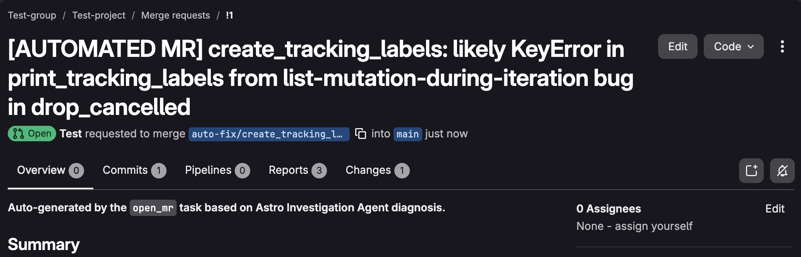

## How to use Otto to automatically investigate Dag failures and open a GitLab merge request with a fix

This repository contains the Astro project for the GitLab variant of the [How to use Otto to automatically investigate Dag failures and PR a fix](https://astronomer.io/docs/learn/airflow-3/airflow-otto-rca-auto-fix) tutorial.

Follow Steps 0, 1, 3, 4, and 5 in the tutorial as written (prerequisites, sign up for Astro, deploy this project, create a Deployment token, create an Astro alert). Step 2 is replaced below, since the original instructs you to fork a GitHub repository.

## Step 2: Get the tutorial repository into GitLab

1. Clone the source repository and check out the GitLab variant branch:

    ```bash
    git clone https://github.com/astronomer/otto-rca-auto-fix-tutorial.git
    cd otto-rca-auto-fix-tutorial
    git checkout gitlab_version
    ```

2. Create a new, empty project on GitLab (gitlab.com or your self-managed instance). Don't initialize it with a README, or the push in the next step will be rejected for diverging history.

3. Point your local clone at the new GitLab project and push the branch as GitLab's `main`:

    ```bash
    git remote set-url origin <your-gitlab-project-url>
    git push -u origin gitlab_version:main
    ```

## Step 6: Create a GitLab token

To open a merge request on GitLab, the AI agent needs access to your GitLab project. Use a **Project Access Token**. It's scoped to just this project rather than your whole personal account.

1. Go to your GitLab project and click **Settings > Access Tokens**.

2. Click **Add new token**, give it a name and an expiration date.

3. Select the **Developer** role and the **api** scope. (You'll need Maintainer or Owner access on the project yourself to create the token.)

4. Click **Create project access token** and copy it to a safe location. GitLab only shows it once.

## Step 7: Add environment variables and a connection

The last set up step is to add the necessary environment variables and the Airflow connection to your model provider to your Deployment.

1. Go to your Astro Deployment and click **Environment**, then **Environment Variables** and **Edit Deployment Variables**.

2. Add the following three environment variables, marking all tokens and keys as `SECRET` with the toggle.

    - `ASTRO_API_TOKEN`: You can reuse the same Astro Deployment token you created in step Step 4. This is the credential the Airflow task uses to authenticate to Astro and run the Otto investigation.
    - `GITLAB_PROJECT`: Your GitLab project in the format `<namespace>/<project>`, or its numeric project ID.
    - `GITLAB_TOKEN`: Your GitLab token, retrieved in Step 6.

    If you're using a self-managed GitLab instance instead of gitlab.com, also add `GITLAB_BASE_URL` set to `https://<your-instance>/api/v4`.

3. Click **Update Environment Variables** to save your changes.

4. Still on your Deployment's environment tab, click **Connections** to add your Pydantic AI connection for the `@task.agent` task that drafts your MR.

5. Select the `Generic` connection form and create a connection to your LLM provider. If you are using OpenAI, add the following values.

    - **Connection ID**: `pydanticai_default`
    - **Connection Type**: `pydanticai`
    - **Password**: Your OpenAI API Key.
    - **Extra**: `{"model":"openai:gpt-5"}`. You can use any valid model for your model provider.

Alternatively, you can use another LLM provider, as long as it is [compatible with Pydantic AI](https://pydantic.dev/docs/ai/models/overview/) and you adjust the extra provided to the `pydantic-ai-slim[<your LLM provider>]` in the `requirements.txt` file for your Astro project. For more options on how to configure the Pydantic AI connection used with the Common AI provider's `@task.agent` decorator, see the [Common AI provider connection documentation](https://airflow.apache.org/docs/apache-airflow-providers-common-ai/stable/connections/pydantic_ai.html).

## Step 8: Test the Dag

Time to test this setup.

1. Go to the Airflow UI and make sure both Dags are unpaused.

2. Run the `create_tracking_labels` Dag manually. It should fail its last task with a `KeyError`.

3. The failing Dag causes the Astro alert to run, and automatically triggers the `otto_rca_to_gitlab_mr` Dag, which investigates the failure and proposes a fix.

4. Wait for the Dag to finish, then check your GitLab project for a new merge request.

Here's what a successful run looks like:


